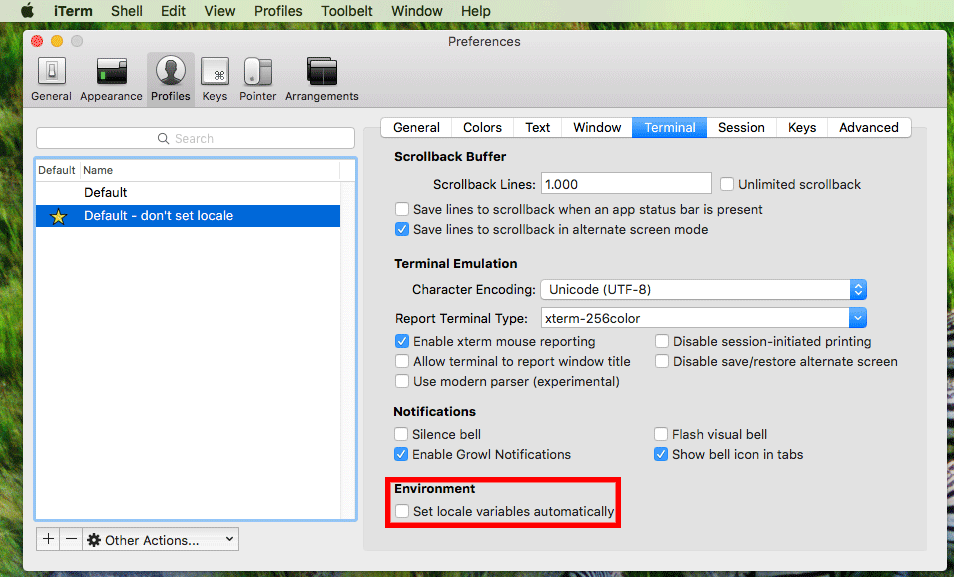

A local development server

Using:
- Java 8 (Oracle)
- Maven
- Git
- MySQL
- Elasticsearch
- MongoDB (with SSL support, making use of a self signed certificate)
- Docker

Running on: Ubuntu 14.04 64bit

Exposing these ports on the host:

- 3306 for MySQL
- 9200 for Elasticsearch
- 9300 for Elasticsearch
- 27017 for MongoDB

Allowing you to connect to these services via localhost. e.g.: `mysql -h localhost -u root -p`.
If you already have one of these services running on your machine the port(s) will conflict and you must change them in the Vagrant file.

By default the amount of memory that the VM is allowed to use is set to 4GB. This and other settings can be changed in the Vagrant file.

## Creating and starting a Virtual Machine

- Install [Vagrant](https://www.vagrantup.com/) (skip this if Vagrant is already installed)

- Create a directory and download the Vagrant file
```bash
mkdir ts-local-dev-server
cd ts-local-dev-server
curl -O https://raw.githubusercontent.com/rlindooren/vagrant-playground/master/ts-local-dev-server/Vagrantfile
```

- Start vagrant (execute this command in the directory you just created)
```
vagrant up
```

- Wait a while (don’t be alarmed by the output flying over your screen)

## Stopping the VM

```
vagrant halt
```

Alternatively you can also remove the VM with `vagrant destroy`

## Logging in into the VM ##

**Option 1: Letting Vagrant do the connection configuration for you**

```
vagrant ssh
```

**Option 2: Using the SSH client yourself**

```
ssh -p 2222 -i .vagrant/machines/default/virtualbox/private_key vagrant@localhost
```

**Option 3: Using SSH with specific config and making use of your public key**

Copy your public key to the VM:

```
cat ~/.ssh/id_rsa.pub | ssh -p 2222 -i .vagrant/machines/default/virtualbox/private_key vagrant@localhost 'cat >> .ssh/authorized_keys'
```

Add this entry to your `.ssh/config` file:
```
Host ts-local-dev-server
  User vagrant
  HostName localhost
  Port 2222
```

Now you can use: `ssh ts-local-dev-server`

## Trusting the self signed certificate used by MongoDB

- Copy the certificate from the VM

```
scp -P 2222 -i .vagrant/machines/default/virtualbox/private_key vagrant@localhost:/usr/lib/ssl/certs/mongodb-cert.crt /tmp/
```

or (see the SSH instructions above)

```
scp ts-local-dev-server:/usr/lib/ssl/certs/mongodb-cert.crt /tmp/
```

- Import the certificate in Java's keystore

```
# Make a backup of the keystore (just in case)
sudo cp $JAVA_HOME/jre/lib/security/cacerts $JAVA_HOME/jre/lib/security/cacerts.original
 
# Import the certificate (the default password of the keystore is 'changeit')
sudo keytool -import -alias localhost -keystore $JAVA_HOME/jre/lib/security/cacerts -storepass changeit -file /tmp/mongodb-cert.crt
```

The commands above are based on Mac OSX

Note: when you update your JDK the certificate has to be trusted again (the new JDK comes with a fresh keystore)

## Hints

**Locale on iTerm**

On Mac OSX it's possible that you get a like this after logging in with SSH:

"WARNING! Your environment specifies an invalid locale."

You can prevent this by not letting iTerm set the locale:



More info about this can be found here: https://blog.hqcodeshop.fi/archives/56-Mac-OS-X-terminal-UTF-8-over-SSH.html

